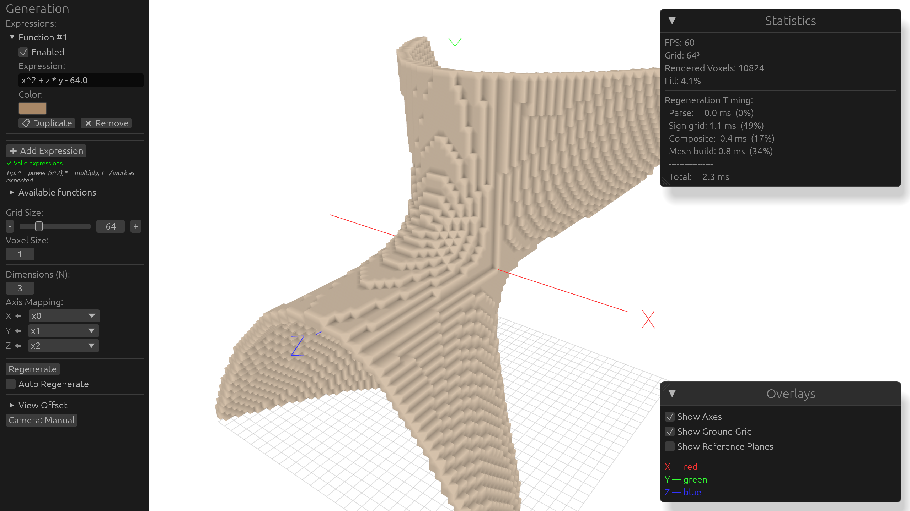

<div align='center'>

# HyperVox

Voxel graphical calculator for N-dimensional mathematical expressions. Each expression is evaluated over a grid and rendered as a colored voxel mesh.

## Overview

HyperVox takes one or more mathematical expressions and renders them as 3D voxel graphics. Enter an expression, pick a color, and adjust the grid; the result is a colored voxel mesh you can rotate and inspect. Expressions are evaluated over an N-dimensional space, so shapes can be defined in more than three dimensions.



A single-threaded build is hosted on GitHub Pages:

<https://timasoft.github.io/hypervox/>

</div>

## How it works

Each expression is parsed and evaluated into a sign grid. All sign grids are composited front-to-back into one voxel grid, where each voxel takes the color of the first expression that fills it. A single mesh with per-corner ambient occlusion is built from that composite.

With more than three dimensions, only the three dimensions mapped to the X, Y, Z axes vary spatially; the rest are held at fixed values, so the render shows a 3D slice of the N-dimensional space.

## Features

- Expression editor with live regeneration (debounced 300 ms)
- Any number of dimensions (`x0`, `x1`, ...), mapped independently to the X, Y, Z axes; unmapped dimensions are fixed at adjustable values
- Each expression is composited front-to-back with its own color (editable, enable/disable, reorder, duplicate, remove)
- Grid size (2-256), voxel size, and world offset controls
- Auto-orbit or manual orbit camera, axis/grid/reference-plane overlays
- Per-stage timing statistics (parse, sign grid, composite, mesh build)

## Expression language

A `hypervox_expr` Pratt parser with constant folding, common-subexpression elimination, and closure compilation (see `expr/README.md` for details):

- Variables: `x`, `y`, `z` (spatial axes) and `x0`...`x{N-1}` (dimensions)
- Operators: `+`, `-`, `*`, `/`, `^`/`**` (power, right-associative), `%`, `|x|`
- Constants: `PI`, `E`
- Functions: `sin`, `cos`, `tan`, `asin`, `acos`, `atan`, `sinh`, `cosh`, `tanh`, `sqrt`, `cbrt`, `exp`, `ln`, `log10`, `log2`, `floor`, `ceil`, `round`, `trunc`, `abs`, `atan2`, `pow`
- `0^0` = `1`

## Build

```bash
cargo build --release   # native
trunk serve             # WASM dev server on 0.0.0.0:8080
nix build .#native      # native release via flake -> result/
nix build .#native-fma  # native release with fused multiply-add (FMA) via flake -> result/
nix build .#web         # WASM release via flake -> result/
```

All builds (native and WASM) require nightly Rust: `.cargo/config.toml` sets `build-std = ["panic_abort", "std"]`. Use `nix develop` for the full toolchain.

> Note: `--features fma` alone (e.g. `cargo build --features fma`) is **not** recommended - without the `+fma` target feature, `f64::mul_add` falls back to a software implementation that can be *slower* than plain `a*b+c`.

## License

- `hypervox` (app): GPL-3.0-or-later (`LICENSE-GPL`)
- `hypervox_expr`: MIT or Apache-2.0 (`expr/LICENSE-MIT`, `expr/LICENSE-APACHE`)
